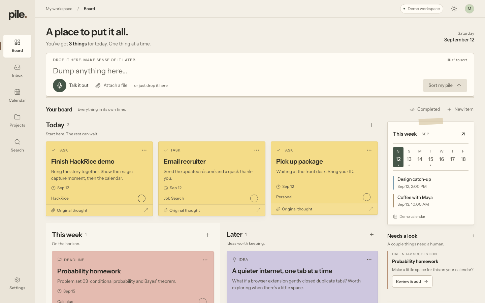

# Pile

**A little less on your mind.** Pile turns a messy capture into the few things you need to do, remember or attend. It is an actionable information filter, not an exhaustive extractor.



Built for HackRice 16 with Next.js 16, React, TypeScript, PostgreSQL, ElevenLabs speech-to-text and optional Backboard memory. The warm paper board is the product; no chat dashboard or forced sponsor flows.

## Run locally

Node 22+ and pnpm 11 are required.

```sh
pnpm install --frozen-lockfile
cp .env.example .env.local
pnpm db:migrate
pnpm db:seed
pnpm dev
```

Open [Pile on localhost](http://127.0.0.1:3001/app). Keep the hostname consistent: each browser cookie identifies a private workspace. Stop the server before running CLI migrations against its embedded database.

```sh
pnpm lint
pnpm typecheck
pnpm test:unit
pnpm test:integration
pnpm test:e2e
pnpm build
pnpm start
```

Stop `pnpm dev` before `pnpm start`; both use port 3001. Playwright can start the development server itself. Install its browser with `pnpm exec playwright install chromium` when needed.

## What works

- Text, recorded voice, PDF, image and plain-text file capture, with original sources retained.
- Conservative syllabus parsing: four important dates, one bounded class schedule, two optional schedules in the demo fixture. Instructor, website and course context belong to the project.
- Grouped review with important items selected, optional schedules unchecked, inline editing, clear/select-all and calendar confirmation.
- Weighted lexical search with meaningful-term matching and independent PDF/image/voice source results. No irrelevant fallback list.
- Google OAuth, calendar selection, stable event IDs, bounded recurrence, explicit approval and conditional event updates.
- Apple Calendar `.ics` downloads with UTF-8 folding, all-day semantics and bounded recurrence. Exports are not live sync.
- Persisted IANA timezone preference, canonical timed instants, unchanged all-day dates.
- Actual PDF page previews, source images, formatted notes and editable voice transcripts.
- Today / This week / Later, project folders, completion/reopening and source provenance.

## Demo mode and truthful integration status

`DEMO_MODE=true` works without credentials. Text uses local rules; the exact sample flyer is recognized by SHA-256; arbitrary image understanding requires the OpenAI-compatible vision provider. The sample transcript is explicitly a demo shortcut. Real recordings use ElevenLabs independently of OpenAI.

No sponsor credentials were available for this pass. Provider HTTP contracts are verified using mocks, not live accounts. Physical microphone speech was not manually verified; automated Chromium recording and injected audio cover the flow. Google events in demo mode are local demo events.

## Environment

| Variable               | Required? / purpose                                                                                                     |
| ---------------------- | ----------------------------------------------------------------------------------------------------------------------- |
| `DEMO_MODE`            | Optional; defaults to true. False requires a text/vision provider for automatic parsing and Google for calendar writes. |
| `DATA_DIR`             | Optional; embedded PGlite directory, default `.data/pile`.                                                              |
| `TIGER_DATABASE_URL`   | Optional; Tiger Data PostgreSQL connection. Takes precedence over `DATABASE_URL`.                                       |
| `DATABASE_URL`         | Optional; any standard PostgreSQL connection. Otherwise PGlite persists locally.                                        |
| `OPENAI_API_KEY`       | Optional; real text and image understanding.                                                                            |
| `OPENAI_BASE_URL`      | Optional; OpenAI-compatible base URL, default `https://api.openai.com/v1`.                                              |
| `OPENAI_MODEL`         | Optional; defaults to `gpt-4.1-mini`.                                                                                   |
| `ELEVENLABS_API_KEY`   | Required only for real audio transcription. Server-only.                                                                |
| `ELEVENLABS_STT_MODEL` | Optional; defaults to `scribe_v2`.                                                                                      |
| `GOOGLE_CLIENT_ID`     | Required for Google OAuth.                                                                                              |
| `GOOGLE_CLIENT_SECRET` | Required for Google OAuth.                                                                                              |
| `GOOGLE_REDIRECT_URI`  | Required for Google OAuth; local value `http://127.0.0.1:3001/api/oauth/callback`.                                      |
| `TOKEN_ENCRYPTION_KEY` | Required for Google; at least 32 characters, used for AES-GCM token encryption.                                         |
| `BACKBOARD_API_KEY`    | Optional; explicit private assistant memory and semantic retrieval.                                                     |
| `BACKBOARD_BASE_URL`   | Optional; defaults to `https://app.backboard.io/api`.                                                                   |

Old `BACKBOARD_THREAD_ID` is no longer used. Each workspace receives a separate assistant because Backboard memory spans threads. The retained legacy OpenAI transcription adapter is not used by the application; its optional `OPENAI_TRANSCRIPTION_MODEL` defaults to `whisper-1`.

For Google, enable Calendar API, register the OAuth web client and exact redirect URI, add a test account if consent is in testing, then use Settings → Connect. Scopes are `calendar.events` and `calendar.calendarlist.readonly`. Reconnect existing authorizations to grant calendar-list access. Disconnect removes the local tokens; existing external events remain.

## Architecture

`app/api/[...path]/route.ts` is the authenticated API boundary. Opaque cookie sessions isolate browser workspaces. `lib/pipeline.ts` claims a persisted processing job; text/vision/PDF parsing is validated and filtered before `lib/store.ts` commits sources, projects and items. The schema allows an empty result: saving a document does not require creating a card.

`lib/actionability.ts` applies importance tiers and deduplication. `lib/syllabus.ts` handles explicit course schedules and metadata. `lib/search.ts` separates item evidence from full-source search. `lib/memory.ts` writes high-value items with ownership metadata to Backboard and merges relevant owned IDs into local results. Corrections update memory records; deletion removes indexed memories before local records.

`lib/calendar.ts` owns Google and demo event adapters. `lib/ics.ts` generates Apple-compatible exports. `lib/recurrence.ts` renders bounded occurrences across DST without expanding persisted schedules. User timezone/calendar preferences live in `user_preferences`.

PGlite and hosted PostgreSQL implement the same DB interface. Repeatable migrations add preferences, private memory assistant mappings, memory IDs, and unique source fingerprints. No vector extension is required.

## Current demo kit

- **Syllabus:** three-page fictional UGS 303 Fall 2026 course. Four assessment dates, Tuesday/Thursday class, optional office hours and tutoring. Lots of course prose stays as context. A repeated assessment date deduplicates.
- **Meeting notes:** original editorial notes with Maya and Jordan's two actions plus a Monday launch. Attendees and ordinary discussion are not cards.
- **Flyer:** restrained Design Night poster, September 17, 2026 at 7 PM, Rice Architecture / Anderson Hall. End time is not invented in extraction; a one-hour calendar default applies when exporting an event without an explicit end.

Regenerate with `pnpm fixtures`. Capture current screens with `pnpm screenshots` against the running app.

## 90-second demo

1. Show the quiet Today board.
2. Paste “Email Maya about internships tomorrow; Chemistry homework due September 20, 2026.” Sort it.
3. Upload the syllabus. Show four dates, one schedule, optional office hours and source details. No professor or Overview cards.
4. Download the selected Apple calendar file, or confirm adding five events to the clearly labeled demo calendar.
5. Open the actual PDF preview, then search “Maya,” “chemistry deadlines,” and nonsense to prove filtering.
6. Show the voice transcript shortcut, explicitly calling it a sample. Use real microphone capture only after configuring and live-verifying ElevenLabs.

## Handoff and verification

Read the [final HackRice handoff](docs/FINAL_HACKRICE_HANDOFF.md), [adversarial QA log](docs/FINAL_QA.md), [complete external ChatGPT critique](docs/CHATGPT_CRITIQUE.md), [independent critique decisions](docs/CRITIQUE_DECISIONS.md), [design principles](docs/DESIGN.md), and [accessibility results](docs/ACCESSIBILITY_RESULTS.json). Previous handoffs are historical snapshots.

Final local gate: **55 unit + 36 integration + 30 Chromium E2E = 121 passing functional tests**, plus lint, typecheck, production build, fresh migrations/seed and visual/accessibility checks. Real sponsor credentials, physical microphone speech and a completed native Apple Calendar import remain unverified. The final handoff contains the precise evidence boundaries and release commit.

The local demo is not a multi-device account product. Browser-cookie sessions, no background external calendar reconciliation, limited deterministic document layouts, no scanned-PDF OCR, and no retained audio playback are intentional current limits. See the handoff for exact tests and provider verification boundaries.
